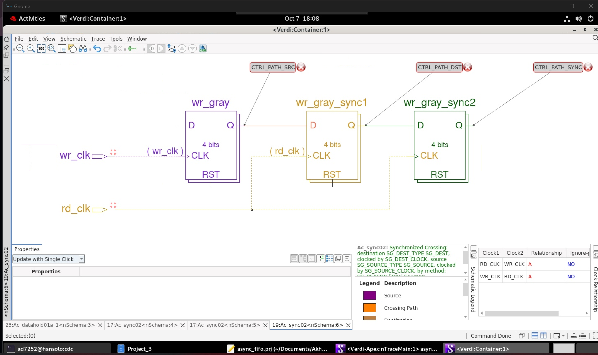
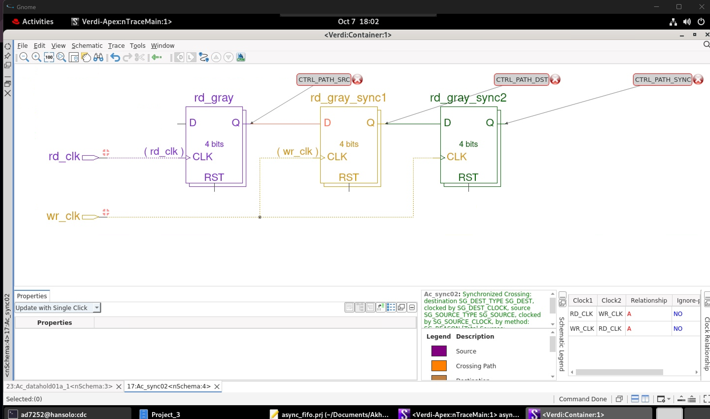
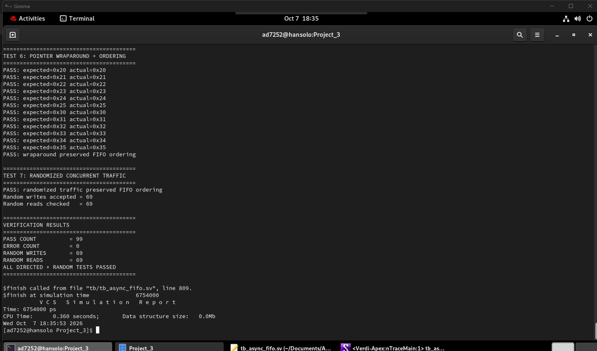
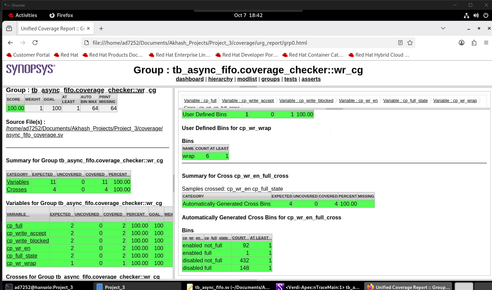
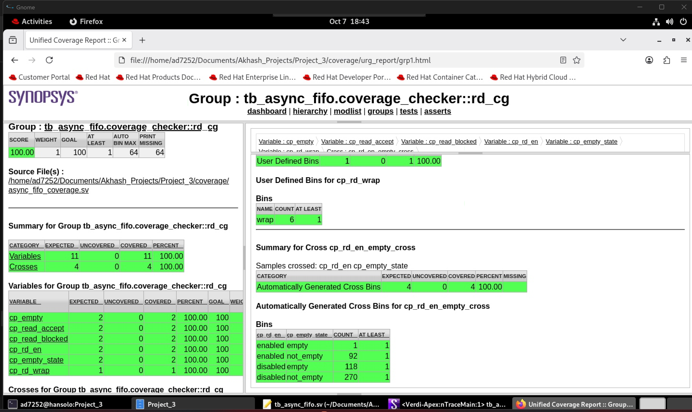
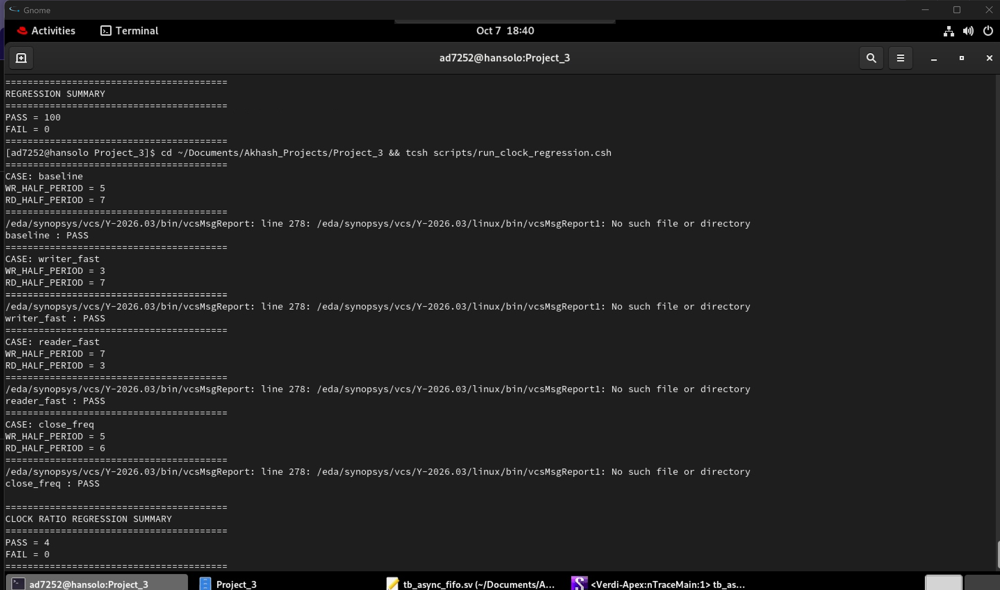
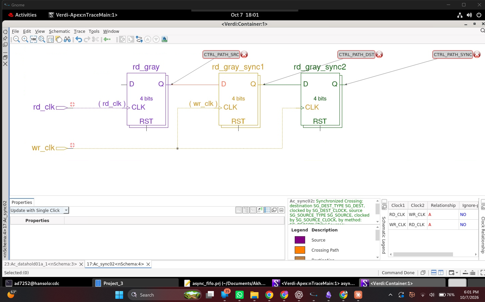
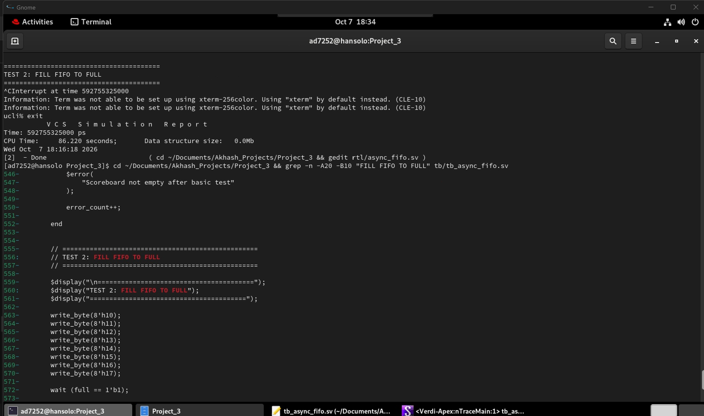
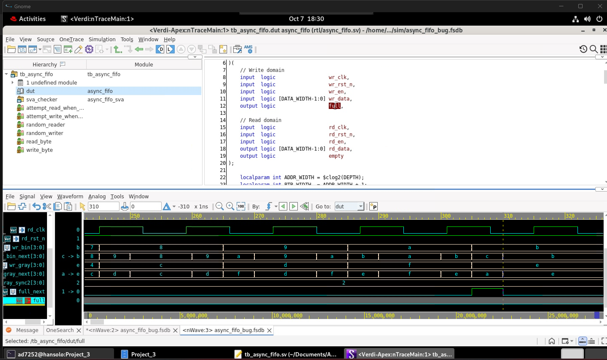

# Async FIFO CDC Verification

A complete Design Verification project for a parameterized asynchronous FIFO using **SystemVerilog, SVA, Synopsys VCS, Verdi, functional coverage, regression automation, and Synopsys VC Static / SpyGlass CDC**.

The project verifies reliable FIFO operation across independent write and read clock domains, with particular focus on **clock-domain crossing, Gray-coded pointer synchronization, full/empty detection, randomized verification, coverage closure, static CDC analysis, and waveform-based root-cause debugging**.

---

## Project Overview

An asynchronous FIFO allows data to move safely between two unrelated clock domains.

This implementation uses:

- Separate `wr_clk` and `rd_clk`
- Independent active-low asynchronous resets
- Binary pointers for memory addressing and arithmetic
- Gray-coded pointers for CDC
- Two-flop synchronizers for pointer transfer
- Write-domain `full` generation
- Read-domain `empty` generation
- Extra pointer bit for wraparound/full detection
- Shared FIFO memory for payload storage

Default configuration:

| Parameter | Value |
|---|---:|
| Data Width | 8 bits |
| FIFO Depth | 8 entries |
| Address Width | 3 bits |
| Pointer Width | 4 bits |

---

## Architecture

The FIFO contains independent write and read logic.

### Write Domain

The write side uses:

- `wr_bin` for binary pointer arithmetic
- `wr_gray` for CDC
- `wr_en` to request a write
- `full` to prevent overflow

A write is accepted only when:

```systemverilog
wr_en && !full
```

The binary write pointer is used to address memory, while the Gray-coded version is transferred to the read domain.

### Read Domain

The read side uses:

- `rd_bin` for binary pointer arithmetic
- `rd_gray` for CDC
- `rd_en` to request a read
- `empty` to prevent underflow

A read is accepted only when:

```systemverilog
rd_en && !empty
```

---

## Why Gray Code?

Binary pointers can change several bits simultaneously.

For example:

```text
0111 -> 1000
```

Four bits change at once.

Sampling a binary pointer while it is crossing into another asynchronous clock domain could therefore capture an inconsistent intermediate value.

Gray code is used because adjacent pointer values differ by only one bit.

The conversion is:

```systemverilog
gray = binary ^ (binary >> 1);
```

Binary pointers remain local for arithmetic and memory addressing, while Gray pointers are used for CDC.

---

## CDC Synchronization

Each Gray-coded pointer passes through a two-flop synchronizer in the destination clock domain.

### Write Pointer Into Read Domain

```text
wr_gray
   |
   v
wr_gray_sync1
   |
   v
wr_gray_sync2
```

`wr_gray` originates in the `wr_clk` domain.

Both synchronizer stages are clocked by `rd_clk`.



### Read Pointer Into Write Domain

```text
rd_gray
   |
   v
rd_gray_sync1
   |
   v
rd_gray_sync2
```

`rd_gray` originates in the `rd_clk` domain.

Both synchronizer stages are clocked by `wr_clk`.



---

## Full and Empty Detection

### Empty Detection

The FIFO becomes empty when the next read pointer matches the synchronized write pointer:

```systemverilog
empty_next = (rd_gray_next == wr_gray_sync2);
```

This calculation is performed entirely in the read clock domain.

### Full Detection

Full detection compares the next Gray-coded write pointer against a transformed synchronized read pointer.

For a reflected Gray-code FIFO, the two most-significant synchronized read-pointer bits are inverted before comparison.

Conceptually:

```systemverilog
full_next =
    (wr_gray_next ==
     {~rd_gray_sync2[PTR_WIDTH-1:PTR_WIDTH-2],
       rd_gray_sync2[PTR_WIDTH-3:0]});
```

This distinguishes the condition where the write pointer is one FIFO capacity ahead of the read pointer.

---

# Verification Strategy

The verification environment combines:

- Directed testing
- Scoreboard-based checking
- Concurrent randomized traffic
- SystemVerilog Assertions
- Functional coverage
- Multi-seed regression
- Multiple asynchronous clock ratios
- Static CDC analysis
- Intentional bug injection
- Verdi waveform debugging

The objective was not simply to show that the FIFO works once, but to build a repeatable verification flow around it.

---

## Directed Tests

The directed suite verifies:

1. Basic FIFO ordering
2. Filling the FIFO until `full`
3. Attempted write while full
4. Draining the FIFO until `empty`
5. Attempted read while empty
6. Pointer wraparound
7. FIFO ordering across wraparound

The scoreboard maintains expected FIFO contents independently of the DUT.

Every successful read is checked against the oldest expected value.

---

## Concurrent Randomized Verification

Random writer and reader processes operate concurrently using the independent clock domains.

The randomized test stresses:

- arbitrary write timing
- arbitrary read timing
- simultaneous read/write activity
- transitions near full
- transitions near empty
- asynchronous clock interaction
- FIFO ordering

Final baseline randomized result:

```text
Random writes accepted = 69
Random reads checked   = 69
```

The complete directed and randomized run finished with:

```text
PASS COUNT  = 99
ERROR COUNT = 0
```



---

# SystemVerilog Assertions

The project includes **12 SVA properties**.

The assertions check:

- Write pointer holds while FIFO is full
- Write pointer increments after an accepted write
- Read pointer holds while FIFO is empty
- Read pointer increments after an accepted read
- Write Gray pointer changes by at most one bit
- Read Gray pointer changes by at most one bit
- Write binary-to-Gray conversion is correct
- Read binary-to-Gray conversion is correct
- Write-domain reset state is correct
- Read-domain reset state is correct
- Write-pointer synchronizer staging is correct
- Read-pointer synchronizer staging is correct

Example accepted-write property:

```systemverilog
(wr_en && !full) |=> wr_bin == $past(wr_bin) + 1;
```

Example Gray transition check:

```systemverilog
$onehot0(wr_gray ^ $past(wr_gray))
```

The final directed and randomized simulations completed with:

```text
0 assertion failures
```

These properties were exercised using simulation. They are not claimed as formal proofs.

---

# Functional Coverage

Functional coverage was implemented independently for the write and read domains.

## Write-Domain Coverage

Coverage includes:

- `full`
- `not_full`
- accepted writes
- blocked writes
- write enable
- write pointer wraparound
- `wr_en × full_state` cross coverage

Result:

```text
100% of defined write-domain functional coverage bins covered
```



## Read-Domain Coverage

Coverage includes:

- `empty`
- `not_empty`
- accepted reads
- blocked reads
- read enable
- read pointer wraparound
- `rd_en × empty_state` cross coverage

Result:

```text
100% of defined read-domain functional coverage bins covered
```



---

# Multi-Seed Regression

A tcsh regression script runs the randomized verification environment using 100 independent random seeds.

Final result:

```text
REGRESSION SUMMARY

PASS = 100
FAIL = 0
```

This provides confidence that the passing result is not dependent on a single random sequence.

---

# Clock-Ratio Regression

Because the FIFO operates between independent clock domains, verification was also repeated using several clock relationships.

| Test | Write Half Period | Read Half Period | Result |
|---|---:|---:|---|
| Baseline | 5 | 7 | PASS |
| Writer Faster | 3 | 7 | PASS |
| Reader Faster | 7 | 3 | PASS |
| Close Frequency | 5 | 6 | PASS |

Final result:

```text
CLOCK RATIO REGRESSION SUMMARY

PASS = 4
FAIL = 0
```



---

# Static CDC Analysis

CDC analysis was performed using **Synopsys VC Static / SpyGlass CDC**.

The design was constrained with:

- `wr_clk`
- `rd_clk`
- separate asynchronous clock domains
- active-low asynchronous write reset
- active-low asynchronous read reset

CDC setup identified:

```text
Clocks  = 2
Domains = 2
Resets  = 2
```

Both Gray-pointer transfers were recognized as conventional multi-flop synchronization structures.

---

## Pointer CDC Results

VC Static reported successful analysis for both pointer crossings.

### Write Pointer

```text
wr_gray -> wr_gray_sync1 -> wr_gray_sync2
```

Result:

```text
Data-loss check: PROVED
```

### Read Pointer

```text
rd_gray -> rd_gray_sync1 -> rd_gray_sync2
```

Result:

```text
Data-loss check: PROVED
```

The reconverging Gray-pointer buses used by the full and empty logic were also analyzed.

Results:

```text
Gray encoding check for full logic  : PROVED
Gray encoding check for empty logic : PROVED
```

---

## FIFO Memory CDC Finding

VC Static also reported one `Ac_datahold01a` finding on the FIFO memory datapath:

```text
wr_clk domain
     |
     v
    mem
     |
     v
rd_data
     |
     v
rd_clk domain
```



This was investigated rather than automatically waived.

The FIFO payload memory is intentionally written in one clock domain and read in another.

Unlike individual control signals, FIFO payload data is not passed bit-by-bit through two-flop synchronizers.

Instead, safe access to memory is controlled by synchronized Gray-coded pointers and the `full` / `empty` protocol.

The finding was therefore retained and documented as part of the CDC analysis.

---

# Intentional Bug Injection

An intentional RTL bug was introduced to verify that the environment could detect and debug an incorrect FIFO implementation.

The full-detection expression was deliberately modified.

## Correct Full Comparison

The correct implementation inverts the two most-significant synchronized read-pointer Gray bits:

```systemverilog
{~rd_gray_sync2[PTR_WIDTH-1:PTR_WIDTH-2],
  rd_gray_sync2[PTR_WIDTH-3:0]}
```

## Injected Bug

The faulty version inverted only the most-significant bit:

```systemverilog
{~rd_gray_sync2[PTR_WIDTH-1],
  rd_gray_sync2[PTR_WIDTH-2:0]}
```

This caused the FIFO to detect `full` against the wrong Gray-code target.

---

## Bug Detection

The directed test filled the FIFO and then waited for:

```systemverilog
wait (full == 1'b1);
```

With the faulty RTL, the expected full condition was not generated correctly and the test stopped progressing.



This established the observable failure symptom.

---

# Root-Cause Debugging in Verdi

The injected bug was analyzed using a Verdi FSDB waveform.

The following signals were inspected:

```text
wr_bin
wr_bin_next
wr_gray
wr_gray_next
rd_gray_sync2
full_next
full
```

The waveform showed that `full_next` asserted against the wrong Gray-code target.

For example, with:

```text
rd_gray_sync2 = 2
```

the correct transformed full target should be:

```text
0010
  |
invert top two bits
  |
1110 = E
```

The injected bug inverted only the most-significant bit:

```text
0010
  |
invert top bit only
  |
1010 = A
```

The waveform confirmed that the faulty circuit responded to the incorrect `A` comparison instead of the correct `E` comparison.



This traced the failure from:

```text
Test hang
   |
   v
full does not behave correctly
   |
   v
full_next comparison examined
   |
   v
wrong Gray-code target identified
   |
   v
incorrect MSB inversion found
```

The correct RTL was then restored.

---

# Post-Fix Validation

After restoring the correct full-detection logic, the verification environment was rerun.

Final results:

| Verification | Result |
|---|---|
| Directed + Random Tests | 99 passed, 0 errors |
| Random Writes | 69 accepted |
| Random Reads | 69 checked |
| SVA | 12 properties, 0 failures |
| Write Functional Coverage | 100% of defined bins |
| Read Functional Coverage | 100% of defined bins |
| Random Regression | 100 / 100 seeds passed |
| Clock-Ratio Regression | 4 / 4 configurations passed |
| CDC Pointer Data-Loss Checks | 2 / 2 proved |
| Gray Reconvergence Checks | 2 / 2 proved |

This completed the full verification and debug cycle:

```text
Design
  |
  v
Directed Verification
  |
  v
Randomized Verification
  |
  v
Assertions + Coverage
  |
  v
Regression
  |
  v
CDC Analysis
  |
  v
Intentional Bug Injection
  |
  v
Failure Detection
  |
  v
Verdi Root-Cause Debug
  |
  v
RTL Restoration
  |
  v
Regression Revalidation
```

---

# Tools Used

- SystemVerilog
- SystemVerilog Assertions
- Synopsys VCS Y-2026.03
- Synopsys Verdi Y-2026.03
- Synopsys VC Static / SpyGlass CDC Y-2026.03
- Synopsys URG
- tcsh
- Linux

---

# Repository Structure

```text
.
├── assertions/
│   └── async_fifo_sva.sv
│
├── cdc/
│   ├── async_fifo.prj
│   └── async_fifo.sgdc
│
├── coverage/
│   └── async_fifo_coverage.sv
│
├── docs/
│   └── images/
│       ├── bug_injection_full_detection_hang.png
│       ├── final_clean_verification_pass.png
│       ├── functional_coverage_read_100_percent.png
│       ├── functional_coverage_write_100_percent.png
│       ├── regression_and_clock_ratio_pass.png
│       ├── spyglass_fifo_memory_datahold_finding.png
│       ├── spyglass_rd_gray_cdc_synchronizer.png
│       ├── spyglass_wr_gray_cdc_synchronizer.png
│       └── verdi_full_detection_bug_root_cause.png
│
├── rtl/
│   └── async_fifo.sv
│
├── scripts/
│   ├── run_clock_regression.csh
│   └── run_regression.csh
│
└── tb/
    └── tb_async_fifo.sv
```

---

# Running the Verification

This project requires access to Synopsys VCS.

## Single Simulation

```bash
mkdir -p sim logs

vcs -full64 -sverilog \
    rtl/async_fifo.sv \
    assertions/async_fifo_sva.sv \
    coverage/async_fifo_coverage.sv \
    tb/tb_async_fifo.sv \
    -top tb_async_fifo \
    -o sim/simv

./sim/simv
```

## 100-Seed Regression

```bash
tcsh scripts/run_regression.csh
```

## Clock-Ratio Regression

```bash
tcsh scripts/run_clock_regression.csh
```

---

# Running CDC Analysis

This flow requires Synopsys VC Static / SpyGlass CDC.

From the `cdc` directory:

```bash
spyglass_vc \
    -project async_fifo.prj \
    -goal cdc/cdc_setup \
    -batch \
    -app cdc
```

Then:

```bash
spyglass_vc \
    -project async_fifo.prj \
    -goal cdc/cdc_verify \
    -batch \
    -app cdc
```

The generated CDC database can also be inspected using the VC Static / Verdi GUI.

---

# Key Learning Outcomes

This project provided practical experience with:

- Asynchronous FIFO architecture
- Independent clock domains
- Metastability-aware CDC design
- Gray-code pointer synchronization
- Two-flop synchronizers
- Full and empty detection
- FIFO wraparound
- Scoreboard-based checking
- Concurrent randomized verification
- SystemVerilog Assertions
- Functional coverage
- Coverage closure
- Regression automation
- Clock-ratio stress testing
- Synopsys VCS
- Synopsys Verdi
- Synopsys VC Static / SpyGlass CDC
- Static CDC result interpretation
- Tool finding investigation
- Intentional bug injection
- Waveform-based first-divergence analysis
- Root-cause debugging
- Post-fix regression validation

---

## Summary

The project demonstrates an end-to-end verification workflow for a dual-clock asynchronous FIFO.

Rather than relying only on directed simulation, the FIFO was verified using assertions, randomized traffic, functional coverage, multi-seed regression, multiple asynchronous clock relationships, static CDC analysis, and deliberate bug injection.

The final design passed all directed and randomized checks, achieved 100% of the defined functional coverage bins, passed 100 regression seeds and four clock-ratio configurations, and had both Gray-pointer CDC structures successfully analyzed by Synopsys VC Static.

An intentionally introduced full-detection defect was also detected by the verification environment, traced to its root cause in Verdi, corrected, and followed by complete regression revalidation.
